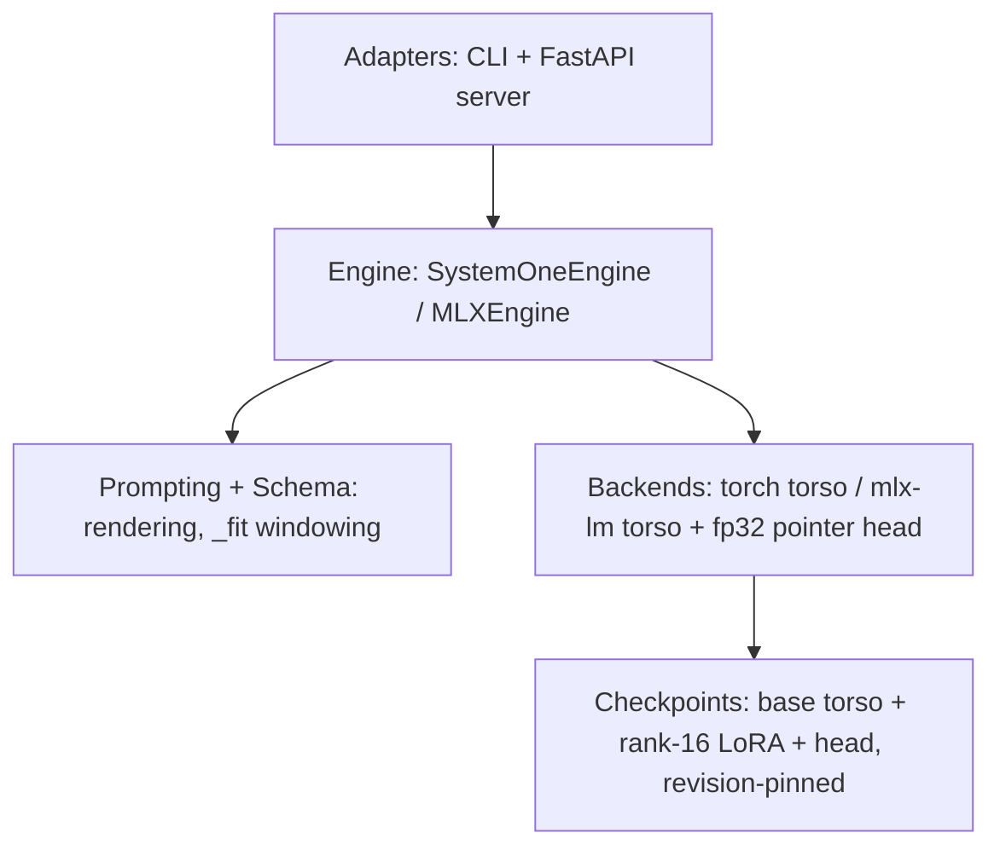

# Strands Decider — System Architecture

<!-- ARCHITECTURE_TYPE: N-LAYER -->

Single-package decision-model server: typed, calibrated answers (noul / choice / score)
from one state, one forward pass, no text generation. This document describes the
system as implemented — upstream design plus the local MLX state-cache work of
2026-10-05. `docs/architecture.md` covers the model's design rationale;
`LOWLEVEL.md` covers module-level mechanics; `adr/` holds the decision records.

## Document Index

**Quick Navigation:**
- [Section 1: Executive Summary](#1-executive-summary)
- [Section 2: System Overview](#2-system-overview)
- [Section 3: Architecture Principles](#3-architecture-principles)
- [Section 4: Architecture Layers](#4-architecture-layers)
- [Section 5: Component Details](#5-component-details)
- [Section 6: Data Flow Patterns](#6-data-flow-patterns)
- [Section 7: Integration Points](#7-integration-points)
- [Section 8: Technology Stack](#8-technology-stack)
- [Section 9: Security Architecture](#9-security-architecture)
- [Section 10: Scalability & Performance](#10-scalability--performance)
- [Section 11: Operational Considerations](#11-operational-considerations)
- [Section 12: Architecture Decision Records (ADRs)](#12-architecture-decision-records-adrs)

**Index Last Updated:** 2026-10-06

## 1. Executive Summary

Strands Decider is a "system one" model: where an LLM generates text, it picks between
options and rates on scales, with a calibrated confidence on every answer. The 2B
checkpoint (v21) answers a JevBench question in a published 115 ms median on an RTX
3090 and serves interactively on Apple silicon; locally measured on an M5 Max through
MLX: **p50 20 ms per JevBench task, warm single-question requests 34–36 ms, repeated
states 18.8 ms** with the cross-request state cache (5.2× over uncached repeats).

**Key metrics** (M5 Max, MLX, warm, unless noted):

| Metric | Value |
| --- | --- |
| Accuracy, JevBench v1 public (231 tasks) | 0.766 local / 0.762 published |
| Brier / ECE | 0.323 / 0.064 (published) |
| Latency p50, single question, short state | 34–36 ms |
| Latency p50, repeated ~1400-token state (cache hit) | 18.8 ms |
| Latency p50, full 4096-token window | ~290–320 ms |
| Throughput, short states | ~50 req/s (GPU-serialised) |
| Questions per request | unbounded (chunked 32/pass); 6.7 ms/q at 500 |

**Business value:** decisions inside agent workflows at LLM-latency prices without an
LLM call — the Strands intervention example routes tool calls for the cost of one
forward pass; the state cache makes follow-up questions on one conversation nearly
free.

## 2. System Overview

### 2.1 Problem / Solution

Agent frameworks need millions of small classified decisions (route, ground-check,
rate-severity) that are too cheap to justify an LLM call and too varied to train a
classic classifier per task. The decider is one general model that answers all of
them, typed and calibrated, from any state text (and, with the vision tower kept,
images).

### 2.2 Solution Overview

A pretrained decoder torso (Qwen3.5-2B-Base) with its language-modelling head removed
and a ~1M-parameter pointer head attached. One forward pass scores every option by
comparing the hidden state at the `<answer>` position against each option's own last
token. The same masked softmax read three ways yields the three question types; label
sets are defined per request, not baked into weights.

### 2.2.1 Design Drivers

#### Value Delivery
- **Threshold**: >50% = High Impact
- **Current Assessment**: HIGH
- **Justification**: repeated-state requests drop 81% in latency (98.2 → 18.8 ms,
  Section 10); the product's own pitch is decision latency far under an LLM call.

#### Scale
- **Threshold**: >100K = High Impact
- **Current Assessment**: LOW (system-level)
- **Justification**: a single-server, single-GPU system by design; scale-out is
  horizontal server replication, not in scope.

#### Impacts
- **Threshold**: >5 = High Impact
- **Current Assessment**: HIGH
- **Justification**: 6 engine-side components plus 7-entry technology stack
  (Section 5, Section 8); model training is a separate CUDA pipeline.

### 2.3 Primary Use Cases

1. **Strands agent tool-call intervention** — before a tool runs, two noul questions
   (grounded? premature?) over the conversation; plain Python turns the probabilities
   into Proceed/Guide.
2. **Routing** — one state, one choice question over N teams, calibrated confidence
   gates escalation to a human.
3. **Rating** — rubric scoring (frustration, urgency, adequacy) with ordinal expected
   value and confidence.
4. **Batch interrogation** — many questions about one document in a single request;
   the state is read once (6.7 ms per additional question at 500).

## 3. Architecture Principles

1. **Separation of Concerns** — schema/prompting/engine/server/CLI are distinct
   modules; the engine knows nothing of HTTP, the server nothing of Metal or CUDA.
   *Trade-off:* two inference backends (torch, MLX) subclass one engine, so a
   backend change touches one file but an engine change touches three.
2. **High Availability** — deliberately not pursued: single worker per GPU, restart
   is a process restart; callers (agents) treat a decision failure as "ask upstream",
   which the confidence field already models. *Trade-off:* no HA machinery to
   operate or test.
3. **Scalability First** — scale per GPU is batching questions (32/pass) and the
   state cache, not request concurrency (Metal/CUDA serialise the device anyway).
   *Trade-off:* concurrent clients see flat throughput and worse tail latency;
   clients should batch, not parallelise.
4. **Security by Design** — server binds 127.0.0.1 by default, no auth on the API by
   design (local trust boundary), model weights and tokenizer pinned by revision from
   checkpoint provenance. *Trade-off:* internet exposure requires an authenticating
   proxy the project does not ship.
5. **Observability** — every response carries usage tokens and server-side latency;
   `/health` reports device, window, cache settings. *Trade-off:* no metrics
   pipeline; operators read logs and the benchmark suite.
6. **Resilience** — malformed requests fail as HTTP 422 with the schema error;
   engine-internal numeric paths degrade (prefix-cache fallback) rather than 500.
   *Trade-off:* a corrupted checkpoint fails fast at load, not at request time.
7. **Simplicity** — one endpoint, three question types, one model; the benchmark
   suite is scripts, not a framework. *Trade-off:* features that need generation or
   multi-step reasoning are out of scope by architecture (see ADR-001).
8. **Cloud-Native** — rejected for this system: single-process CPU/GPU server,
   docker-optional. *Trade-off:* container story is "run the CLI"; no orchestration
   is assumed or provided.
9. **Open Standards** — the HTTP surface follows the public Jev API shape so the
   JevBench typesafe adapter runs unchanged; checkpoints and the LoRA adapter are
   plain HF-format artefacts. *Trade-off:* API evolution is constrained by external
   compatibility.

## 4. Architecture Layers

N-Layer, five layers, dependencies pointing downward only:



1. **Adapters** — Typer CLI (`ask`, `serve`) and the FastAPI app (`POST /v1/systemone`,
   `GET /health`). Own request parsing, response shaping, flags. No model knowledge.
2. **Engine** — `SystemOneEngine` (torch) subclassed by `MLXEngine` (Metal). Owns
   evaluation: batching, prefix caching (intra- and cross-request), the readout, and
   the single-evaluation lock.
3. **Prompting/Schema** — Pydantic question models; rendering of state and questions;
   the question-first window fit (`_fit`) and option-token indexing.
4. **Backends** — the torso forward on torch (CUDA/MPS/CPU) or mlx-lm (Metal, LoRA
   merged at load), and the fp32 pointer head run on torch CPU in the MLX path.
5. **Checkpoints** — HF-format base torso at a pinned revision, decider config,
   adapter, head weights; resolution through the local cache or the Hub.

## 5. Component Details

### 5.1 HTTP Server (`server.py`)
FastAPI app built by a factory; global engine singleton. Pydantic validates the
request (union of Noul/Choice/Score questions); responses carry model name, answers,
usage, and measured latency. Single uvicorn worker — the model owns the GPU.
**Interface:** `create_app(checkpoint, device, use_prefix_cache, state_cache, ...)`;
`serve()` wraps uvicorn.

### 5.2 CLI (`cli.py`)
Typer commands `serve` and `ask`. `ask` renders choices/noul/score flags into one
request — same engine, no HTTP. Owns device auto-detection (cuda > mps > cpu; mlx
only when asked).

### 5.3 Engine (`infer.py`)
`SystemOneEngine.evaluate`: render questions → check slot ceilings → chunk by
`max_batch` → per chunk choose the shared-prefix path (>1 question) or whole-prompt
path (1 question, measured cheaper) → masked softmax → typed answers with confidence
formulas. `_fit` gives the question first claim on the 4096-token window.

### 5.4 MLX Engine (`mlx_engine.py`)
Subclass overriding the forward only: torso on Metal via mlx-lm, LoRA folded into
base weights at load (fp32 on CPU, rounded once), head on torch CPU. Both evaluation
paths preserved. Adds the **cross-request state cache**: LRU of state-token-id →
batch-1 prompt-cache snapshot, populated on the shared-prefix path, read on both
paths (ADR-004).

### 5.5 Model / Head (`modeling.py`)
`StrandsDeciderModel`: torso + pointer head + temperature application. The head
holds no per-option parameters — option count is bounded only by the window.

### 5.6 Benchmarks (`bench/`)
`bench_types.py` (1000/type), `bench_all.py` (7-section synthetic sweep),
`bench_corpus.py` (real labelled corpora, accuracy + latency),
`jevbench_4b_letters.py` (frozen 4B comparison), `run.sh`. Pure mapping functions
are unit-tested; scripts themselves are operator tools, not CI.

## 6. Data Flow Patterns

Request → answer:

```mermaid
sequenceDiagram
    participant C as Client
    participant S as Server (Pydantic)
    participant E as Engine (_fit, cache)
    participant G as GPU (torso)
    C->>S: POST /v1/systemone {state, questions}
    S->>E: validated request
    E->>E: render; _fit (question-first windowing)
    E->>E: state cache lookup (MLX)
    alt hit
        E->>G: question suffixes vs snapshot fan-out
    else miss
        E->>G: whole prompt (1 q) or state-then-suffixes (n q)
        E->>E: store snapshot (multi-q only)
    end
    G-->>E: hidden states
    E->>E: pointer head, temperature, masked softmax
    E-->>S: typed answers + confidence + usage
    S-->>C: JSON (latency measured server-side)
```

**Cache-hit flow** skips the state forward entirely — the dominant cost for long
states. Answers are identical within float tolerance either way (pinned by tests and
a full JevBench run).

## 7. Integration Points

| Integration | Protocol | Notes |
| --- | --- | --- |
| Strands Agents SDK | in-process Python (examples/strands) | InterventionHandler asks noul questions before tool calls; expects a local server |
| JevBench harness | HTTP, typesafe adapter, `/v1/systemone` | Runs unmodified; the compatibility constraint for API evolution |
| Hugging Face Hub | model download, revision-pinned | Base torso resolved at the revision training used; decider checkpoints `StrandsAgents/*` |
| HF tokenizers / transformers | library | Torch path; MLX path uses mlx-lm's loading of the same artefacts |

## 8. Technology Stack

| Layer | Technology |
| --- | --- |
| Language | Python 3.13 |
| Server | FastAPI + uvicorn (single worker) |
| CLI | Typer + Rich |
| Schema | Pydantic v2 |
| Torch backend | PyTorch + transformers (CUDA / MPS / CPU) |
| Apple-silicon backend | mlx + mlx-lm (pinned minor) |
| Adapter | PEFT LoRA (rank 16), merged at load on MLX |
| Model artefacts | safetensors, HF format |
| Tests | pytest (tiny random-checkpoint harness; Apple-silicon-gated MLX tests) |
| Benchmarks | stdlib HTTP clients; JevBench at pinned commit for evaluation |

## 9. Security Architecture

- **Boundary:** loopback by default (`--host 127.0.0.1`); the API is unauthenticated
  by design for local agent use. Internet exposure requires an authenticating
  reverse proxy the project does not provide.
- **Supply chain:** the base torso loads at the exact revision recorded in checkpoint
  provenance (a fixed commit, not a moving tag). The MLX loader refuses adapters it
  cannot merge exactly rather than skipping tensors.
- **Input:** Pydantic unions validate the request; over-long prompts are truncated
  (or rejected with 422 under `--strict-window`). Untrusted state text is data, never
  instructions — the model has no generation capability to prompt-inject.
- **Images (`--vision`):** torch devices only; out of scope for the MLX path.

## 10. Scalability & Performance

Measured on M5 Max, MLX, warm (the `bench/` suite reproduces all figures):

| Dimension | Behaviour |
| --- | --- |
| State length | ~linear in tokens to the 4096 window, then clamped (truncation): ~290–320 ms full-window |
| Question type | no effect (34–36 ms single-question short state across noul / choice / score) |
| Choice width | 2→50 options: 31.7→52.7 ms (option tokens, not parameters) |
| Questions per request | amortises the state: 51 ms/q → 6.7 ms/q at 500 |
| Repeated states | cache hit 18.8 ms vs 98.2 ms miss (~1400-token state): 5.2× |
| Concurrency | flat ~50 req/s at 1/4/16 clients — GPU serialises; batch, don't parallelise |
| Accuracy guard | corpus benchmark reports accuracy (0.72–0.73 on internal eval sets) alongside latency |

**Capacity planning rule:** `--state-cache N` must exceed the client's distinct-state
working set or it yields zero benefit (measured: 60 states / 8 entries = 0% gain;
60 / 128 = 2.3×). Entry memory scales with state length.

## 11. Operational Considerations

- **Run:** `strands-decider serve <ckpt> --device mlx --state-cache 8 --port 8000`;
  `/health` verifies checkpoint, window, device, caches.
- **Verify:** `bash bench/run.sh` against the live server (corpus → synthetic →
  types); watch accuracy as a correctness tripwire.
- **Evaluate:** JevBench via the repo's pinned-commit harness; expect 0.762 ± noise
  for v21 — single-run differences under ~10 tasks are unresolved by the repo's own
  rule.
- **Known numeric drift:** Metal-kernel parity tests drift 0.0003 vs the 1.5e-4
  tolerance on some hardware (pre-existing, upstream).
- **Process model:** one worker per GPU; restart is recovery. Logs to stdout.

## 12. Architecture Decision Records (ADRs)

| ADR | Title | Status | Date | Impact |
| --- | --- | --- | --- | --- |
| [ADR-001](adr/ADR-001-pointer-head-not-generation.md) | Pointer head instead of text generation | Accepted (upstream) | 2026-09 | High |
| [ADR-002](adr/ADR-002-question-first-window.md) | Question-first claim on the context window | Accepted (upstream) | 2026-09 | High |
| [ADR-003](adr/ADR-003-mlx-backend.md) | MLX backend with LoRA merged at load | Accepted (upstream) | 2026-09 | Medium |
| [ADR-004](adr/ADR-004-cross-request-state-cache.md) | Cross-request state KV cache on the MLX engine | Accepted (local) | 2026-10-05 | High |
| [ADR-005](adr/ADR-005-benchmark-suite.md) | Benchmark suite as operator tooling, not CI | Accepted (local) | 2026-10-05 | Medium |
