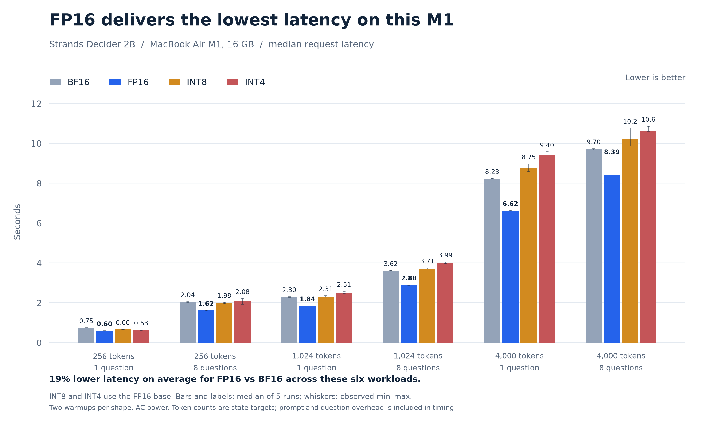
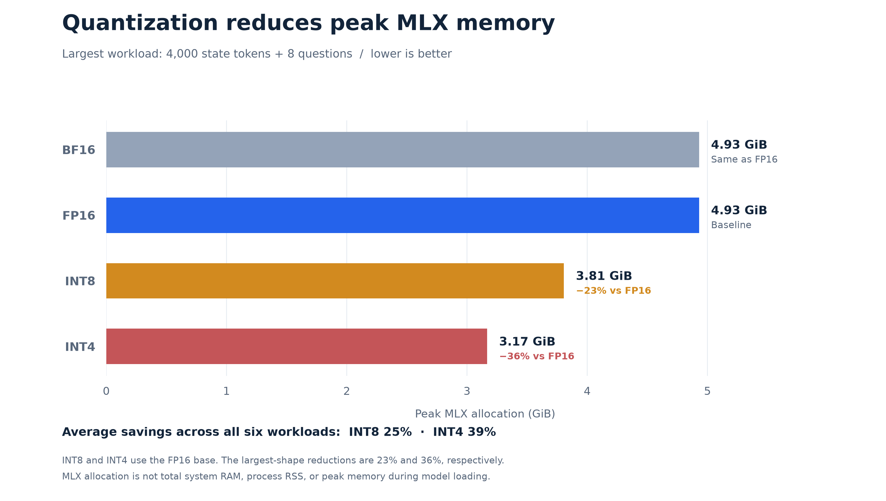

# Faster local decisions on M1: where fp16 and quantization help

*Strands Decider 2B on a 16 GB MacBook Air. Six workloads, four precision options, and a practical tradeoff between response time, memory, and answer quality.*

A local decision model can sit directly in an application's request path, choosing a route, checking a condition, or scoring an input. Every extra second becomes part of the user's wait. Reducing model size seems like an obvious way to make those decisions faster, especially on a laptop with shared memory.

Our M1 measurements show why that assumption needs testing. Lower-precision weights reduced peak MLX memory, but they did not reduce request latency. The most effective latency improvement came from switching the floating-point torso from bfloat16 to fp16.

This post compares the clean warm-run results and explains how to choose a precision for this machine. The useful distinction is between making a model respond faster and making it fit in less memory.

## Start with fp16 when response time matters

**Fp16 had the lowest median latency in every workload.** Compared with bfloat16, it reduced latency by 13–20%, with an unweighted average reduction of 19% across the six cases. Both formats use 16-bit floating-point weights, and their measured peak MLX allocations were essentially identical.

*Bars show median request latency over five timed repetitions. Whiskers show the observed minimum and maximum, not confidence intervals. INT8 and INT4 use the fp16 base. Token labels refer to the requested state length; timing includes prompt processing and question overhead.*

For a 256-token state and one question, fp16 reduced the median from 0.75 seconds to 0.60 seconds. At 4,000 tokens and eight questions, it reduced the median from 9.70 seconds to 8.39 seconds. These are different workloads, but the direction of the result is consistent.

**The quantization base matters.** At the largest workload, int8 derived from bfloat16 took 15.10 seconds. Int8 derived from fp16 took 10.21 seconds, compared with 8.39 seconds for unquantized fp16. The plot uses the fp16-based quantized variants so that the comparison identifies which base each configuration uses.

Against fp16, int8 increased latency by 11–32% across the six workloads. Int4 increased it by 6–42%. Int4 was slightly faster than int8 in the shortest, single-question case, but slower in the other five. Neither quantized variant beat fp16.

## A smaller model does not guarantee a faster request

**This workload scores decisions rather than generating a token stream.** Strands Decider replaces the language-model output head with a small pointer head. It processes the input and scores the available options without an autoregressive decoding loop. Multi-question requests can share the state prefix.

That distinction matters when interpreting quantization results. Moving fewer weight bytes can help, but quantized inference also changes the arithmetic and kernels used to process the input. In these runs, the reduced weight precision did not translate into lower end-to-end latency.

The result is consistent with conversion or quantized-kernel overhead outweighing the memory-traffic saving. It does not, by itself, prove that computation is the sole bottleneck. These benchmarks measured request latency and memory, not a kernel-level breakdown of where time was spent.

## Use quantization to reduce peak MLX memory

**The memory saving is clear.** On the largest workload, peak MLX allocation fell from 4.93 GiB with fp16 to 3.81 GiB with int8 and 3.17 GiB with int4. Those reductions are approximately 23% and 36%, respectively.

*The chart shows inference-time peak MLX allocation for the largest workload. This is not total system RAM, process resident memory, or peak memory during model loading.*

Across all six workloads, the average reduction was 25% for int8 and 39% for int4. Those figures describe a useful deployment option: a smaller MLX working set in exchange for additional latency.

Quantization was selective. The setup merged the LoRA adapter before quantizing the selected torso projections. It kept the separate decision head in fp32 and left embeddings, normalization layers, and protected recurrent-state components unquantized. The measured savings therefore apply to this implementation, not to a model in which every parameter uses four or eight bits.

## Preserve accuracy before trading away precision

**Int8 preserved every evaluated decision.** On the 72 JevBench `original` tasks, bfloat16, fp16, and int8 each answered 65 correctly. Int8 changed no predicted labels relative to the floating-point baseline in its run.

| Precision | Correct answers | Accuracy |
| --- | ---: | ---: |
| BF16 | 65 / 72 | 90.3% |
| FP16 | 65 / 72 | 90.3% |
| INT8 | 65 / 72 | 90.3% |
| INT4 | 62 / 72 | 86.1% |

Int4 changed three decisions and reduced accuracy by 4.2 percentage points. Its smaller allocation may still matter when capacity is the limiting constraint, but that benefit comes with both a latency cost and an observed quality loss.

These are results from 72 tasks, not a guarantee that int8 preserves quality on every application. The unchanged decisions make it a reasonable candidate for further evaluation on a representative workload.

## Choose for the constraint you actually have

- **For the lowest latency on this M1, start with fp16.** It led all six clean warm-run cases and matched the other full-precision configuration's task accuracy.
- **For a smaller MLX allocation, evaluate int8.** It saved about 25% on average and preserved the tested decisions, while increasing latency relative to fp16.
- **For more severe memory limits, treat int4 as an explicit compromise.** It saved about 39% on average, but it was slower than fp16 and less accurate on this evaluation.

These findings apply to this M1 MacBook Air and this inference implementation. They do not establish a default for every Apple chip or for CUDA hardware. Different hardware and kernels need their own measurements.

## Reproduce the comparison on your workload

**The test setup.** The clean runs used a 16 GB M1 MacBook Air on AC power at full charge, MLX 0.32.3, and affine int8/int4 quantization. The bfloat16-based and fp16-based sweeps each took about 17 minutes. Each precision loaded in a fresh process, with two warmups and five timed repetitions per shape. The benchmark combined three state lengths, 256, 1,024, and 4,000 tokens, with one or eight questions. Quality was evaluated on 72 JevBench tasks.

Use the [reproduction guide](m1-quantization.md) to run the same harness, then replace the synthetic states and evaluation tasks with inputs that resemble your application. Compare latency, peak MLX allocation, and decision quality together before choosing a precision.

The figures are reproducible with [the plotting script](../evaluation/plot_m1_warm.py). The [plotted data](img/m1-plot-data.csv), [source-file hashes](img/m1-plot-provenance.json), and complete [bfloat16-based](../reports/m1-bf16-clean/comparison.csv) and [fp16-based](../reports/m1-fp16-clean/comparison.csv) results are saved with this article.
